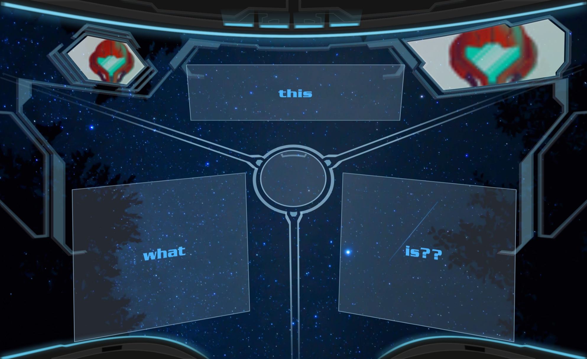
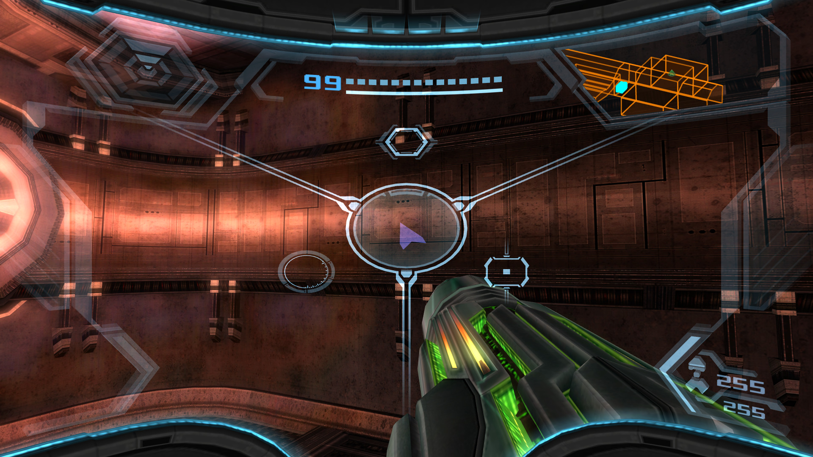

# [Metroid Prime-like React Components](https://pelmers.github.io/metroid-prime-react-components/)

## Introduction

Even though the games came out more than a decade ago, I still remember the
Metroid Prime series as some of the most immersive games I've ever experienced,
from the eerie way Samus's face [reflects in the visor](https://twitter.com/mctroid/status/1226199961970380801) in dark areas to
how you discover the world by [physically scanning them](https://metroid.fandom.com/wiki/Scan_Visor).

Source Gaming [published a detailed look](https://sourcegaming.info/2017/06/28/holism-metroid-prime-and-the-scan-visor/)
at how the game's interface elements serve as a narrative tool that elevates
the story. It's a great read on _Prime_'s design!

In this project I'm playing around with some front-end work by implementing
parts of the game's helmet HUD UI as react.js components.

It's work in progress! I know I've cut some corners here (yes, figuratively and
literally), and some of the items don't quite align perfectly.

Also, see my [blog post](https://pelmers.com/metroid-prime-react-components/)
that contains more details on this work.

## Example



See the [working demo site](https://pelmers.github.io/metroid-prime-react-components/).

## Reference



## Development

```
yarn
yarn watch
```

Then open `dist/index.html` to see the demo site.
`yarn format` to prettier-ify the code.

## Usage

See the [demo page](./src/demo/main.tsx).

Note: not published on npm just yet.

### Remarks

-   The fact that
    [Dread](https://www.nintendo.com/games/detail/metroid-dread-switch/) was
    announced just before I published this project is complete coincidence.
-   I created the SVG files in [Figma](https://www.figma.com/), which might be
    somewhat unconventional but it was much easier to pick up than something like
    Inkscape (and cheaper than Illustrator, of course!)

### TODO

-   Add 'combat visor' screen
-   Add 'scan visor' screen
